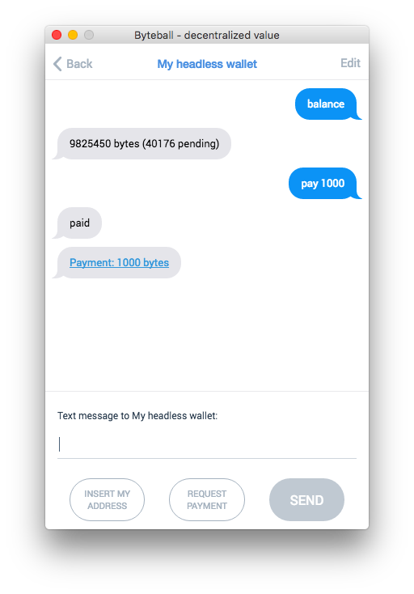

# Headless wallet for DAG Pizza network

This is a headless alternative of the [GUI wallet](../../../dag-pizza) for DAG Pizza network.  It is designed for an always-online deployment on a server.

## Install

Install node.js, clone the repository, then say
```sh
npm install
```
If you want to accept incoming connections, you'll need to set up a proxy, such as nginx, to forward all websocket connections on a specific path to your daemon running this code.  See example configuration for nginx in [dag-pizza-dough](../../../dag-pizza-dough) documentation.

## Run
```sh
node start.js
```
The first time you run it, it will generate a new extended private key (BIP44) and ask you for a passphrase to encrypt it.  The BIP39 mnemonic will be saved to the file keys.json in the app data directory (see [dag-pizza-dough](../../../dag-pizza-dough) for its location), the passphrase is, of course, never saved.  Every time you start the wallet, you'll have to type the passphrase.  One implication of this is the wallet cannot be started automatically when your server restarts, you'll have to ssh the server and type the passphrase.

After you enter the passphrase, the wallet redirects all output to a log file in your app data directory but it still holds the terminal window.  To release it, type Ctrl-Z, then bg to resume the wallet in the background.  After that, you can safely terminate the ssh session.

## Customize

If you want to change any defaults, refer to the documentation of [dag-pizza-dough](../../../dag-pizza-dough), the core Byteball library `require()`'d from here.  Below are some headless wallet specific settings you might want to change:

* `control_addresses`: array of device addresses of your other (likely GUI) wallets that can chat with the wallet and give commands.  To learn the device address of your GUI wallet, click menu button, then Global preferences, and look for 'Device address'.  If your `control_addresses` is empty array or contains a single address that is invalid (this is the default), then nobody can remotely control your wallet.
* `payout_address`: if you give `pay` command over chat interface, the money will be sent to this Byteball address.
* `hub`: hub address without wss://, the default is `byteball.org/bb`.
* `deviceName`: the name of your device as seen in the chat interface.
* `permanent_paring_secret`: the pairing secret used to authenticate pairing requests when you pair your GUI wallet for remote control.  The pairing secret is the part of the pairing code after #.


## Remote control

You can remotely control your wallet via chat interface from devices listed in `control_addresses`.  When the wallet starts, it prints out its pairing code.  Copy it, open your GUI wallet, menu button, paired devices, add a new device, accept invitation, paste the code.  Now your GUI wallet is paired to your headless wallet and you can find it in the list of correspondents (menu, paired devices) to start a chat.  There are three commands you can give:

* `balance`: to request the current balance on the headless wallet;
* `address`: to get to know one of the wallet's addresses, you use it to refill the wallet's balance;
* `pay <amount in bytes>` to request withdrawal from the headless wallet to your `payout_address`.



## Differences from GUI wallet

* Headless wallet (as software) can have only one wallet (as storage of funds) AKA account, its BIP44 derivation path is `m/44'/0'/0'`.  In GUI wallet (as software) you can create multiple wallets (as storage of funds).
* Headless wallet cannot be a member of multisig address because there is nobody to present confirmation messages to.  Hence, you can't have multisig security on headless wallets and have to have other security measures in place.

## Security recommendations

First, don't run the server wallet if you don't absolutely need to.  For example, if you want to only accept payments, you don't need it.  Consider server wallet only if you need to *send* payments in programmatic manner.

Having the keys encrypted by a passphrase helps protect against the most trivial theft of private keys in case an attacker gets access to your server.  Set a good passphrase that cannot be easily bruteforced and never store it on the server.  

However, that is not enough.  If an attacker gets access to your server, he could also modify your conf.json and change `control_addresses` and `payout_address`, then wait that you restart the wallet and steal its entire balance.  To help you prevent such attacks, every time the wallet starts it prints out the current values of `control_addresses` and `payout_address`, please pay attention to these values before entering your passphrase.

Use TOR ([conf.socksHost, conf.socksPort, and conf.socksLocalDNS](../../../dag-pizza-dough#confsockshost-confsocksport-and-confsockslocaldns)) to hide your server IP address from potential attackers.

Don't keep more money than necessary on the server wallet, withdraw the excess using `pay` command in the chat interface.

## Custom commands

Payments are the central but not the only type of data that Byteball stores.  In [play/](play/) subdirectory, you will find many small scripts that demonstrate how to create other message types that are not available through the GUI wallet.  In particular, you can declare and issue your own assets, post data as an oracle, create polls and cast votes.  Just edit any of these scripts and run it.

## RPC service

By default, no RPC service is enabled.  If you want to manage your headless wallet via JSON-RPC API, e.g. you run an exchange, run [play/rpc_service.js](play/rpc_service.js) instead.  See the [documentation about running RPC service](../../wiki/Running-RPC-service).
